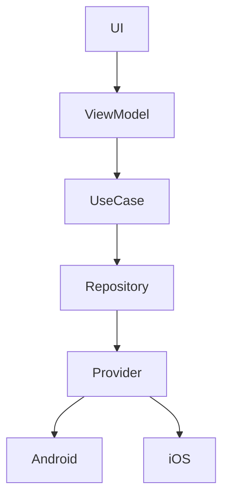

# 🎬 MovieApp

> ⚠️ **This project is intended solely for application/portfolio purposes.**
> It does not represent my full knowledge, capabilities, or potential as a developer.
> The app is meant to provide a brief insight into my development style and way of working.

> 💡 **The solution approaches, architectural decisions, and implementations used in this project are not final.**
> They serve purely as an illustration of how certain problems can be approached.
> In a real-world or production environment, solutions would be designed, reviewed, and refined more thoroughly.

---

## 📌 About the Project

MovieApp is a cross-platform application built with **Kotlin Multiplatform (KMP)**, running on **Android** and **iOS**.

The application demonstrates:

- Clean Architecture in a KMP environment
- Cross-platform state handling with Flow
- ViewModel-driven business logic
- Platform abstraction (Android / iOS)
- Hardware & permission handling via a shared module

---

## 🛠️ Tech Stack

| Technology | Usage |
|---|---|
| Kotlin Multiplatform (KMP) | Shared business logic |
| Compose Multiplatform | UI |
| Koin | Dependency Injection |
| Ktor | Networking |
| Coroutines & Flow | Async & reactive streams |
| FusedLocationProvider | Android location |
| CoreLocation | iOS location |

---

## 📱 Supported Platforms

| Platform | Version |
|---|---|
| Android | API 35 |
| iOS | 15.0 |

---

## 📁 Project Structure

movieapp/
- composeApp/
- iosApp/
- core/
- device_operations/
- movie/
- series/
- search/
- content_detail/
- discover/

---

## 🏗️ Architecture

Layers:
- Presentation (Compose, ViewModel)
- Domain (UseCases)
- Data (Repositories)
- Platform (Android / iOS)

---

## 🧭 Architecture Diagram

---

## 🔒 Device Operations

- Camera
- Gallery
- Location
- Microphone

---

## 🔄 State & Flow Handling

- Flow-based
- Cold streams
- ViewModel controlled

---

## 📱 Platform Integration

Android:
- ActivityResult APIs

iOS:
- PHPicker
- CoreLocation

---

## 🧠 Architectural Decisions

- Flow over callbacks
- ViewModel driven
- Platform abstraction

---

## 🌍 Localization

- en
- de

---

## 🎨 UI

- Compose Multiplatform
- Light/Dark mode

---

## 📄 License & Terms of Use

**All rights reserved.**

This project is **strictly intended for application and demonstration purposes only**. Any commercial use, redistribution, duplication, or usage of the code — in whole or in part — is **expressly prohibited without the prior written consent of the author**.

This includes but is not limited to:
- Any form of commercial use
- Selling or licensing the code
- Using it in your own products or services
- Publicly redistributing the source code

If you are interested in a collaboration or licensing, feel free to reach out directly.

---

## 👤 Author

**Emrah Cicek**
- GitHub: [@DevMrE](https://github.com/DevMrE)
- LinkedIn: [linkedin.com/in/your-profile](https://linkedin.com/in/your-profile)

